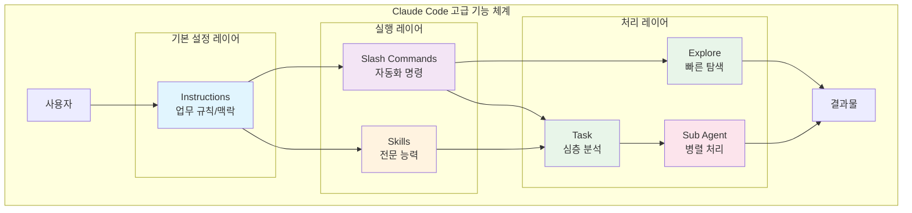
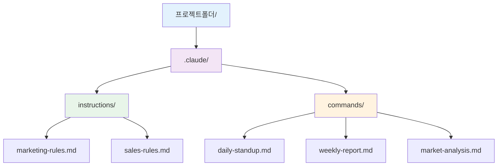
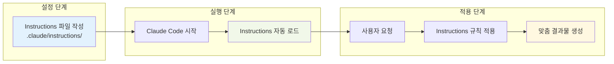
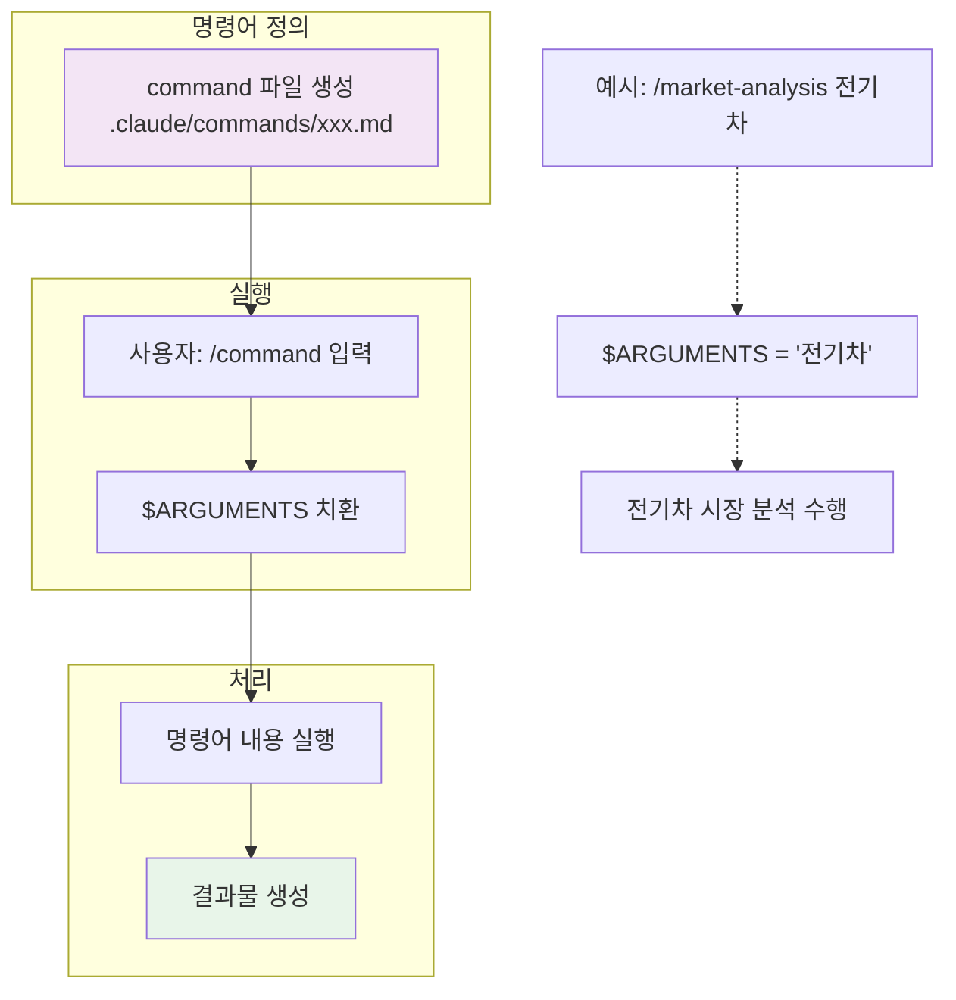
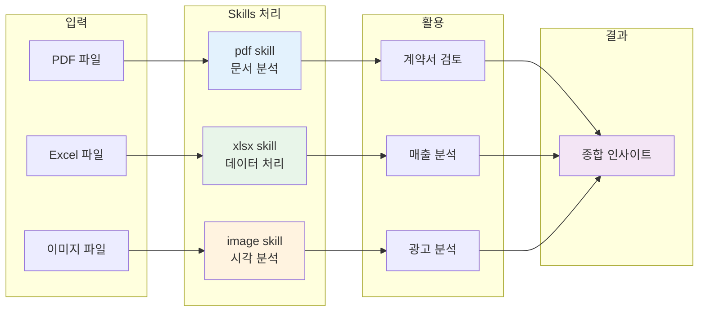
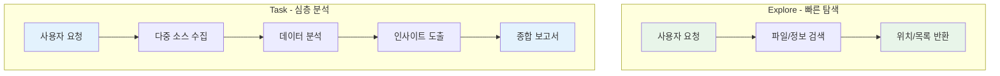
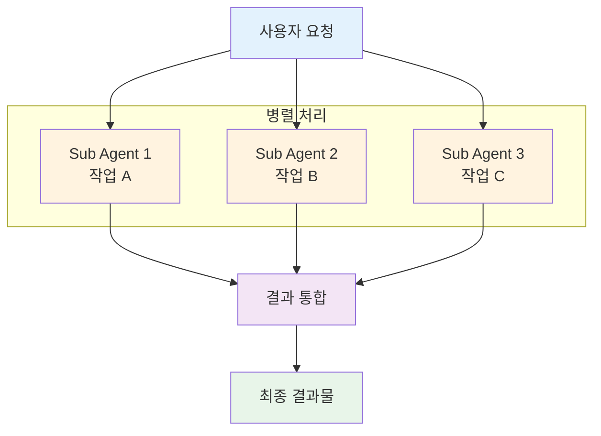
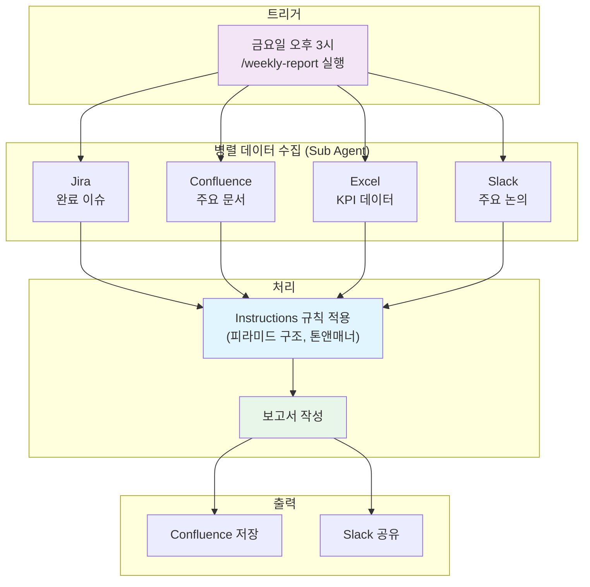

# Claude Code 고급 기능 완전 정복

비개발자도 이해하고 바로 활용할 수 있는 Claude Code의 핵심 기능들을 설명합니다.

---

## 목차
1. [왜 이 기능들을 알아야 하나?](#왜-이-기능들을-알아야-하나)
2. [Instructions - AI에게 업무 규칙 가르치기](#1-instructions---ai에게-업무-규칙-가르치기)
3. [Slash Commands - 나만의 자동화 버튼](#2-slash-commands---나만의-자동화-버튼)
4. [Skills - 전문 능력 장착하기](#3-skills---전문-능력-장착하기)
5. [Explore & Task - AI 탐정 보내기](#4-explore--task---ai-탐정-보내기)
6. [Sub Agent - AI 팀원 고용하기](#5-sub-agent---ai-팀원-고용하기)
7. [실전 조합 활용](#6-실전-조합-활용)
8. [시작하기 체크리스트](#7-시작하기-체크리스트)

---

## 왜 이 기능들을 알아야 하나?

### 일반적인 AI 사용의 한계

```
매번 같은 설명을 반복해야 함
"우리 회사는 B2B SaaS이고, Jira를 쓰고, 보고서는 이런 형식으로..."
"아까 말한 그 형식으로 다시 해줘..."
```

### Claude Code 고급 기능의 장점

```
한 번 설정하면 계속 적용됨
매번 반복할 필요 없음
팀 전체가 같은 방식으로 사용 가능
복잡한 작업도 한 번에 처리
```

| 기능 | 비유 | 효과 |
|------|------|------|
| Instructions | AI에게 주는 업무 매뉴얼 | 매번 설명 안 해도 됨 |
| Slash Commands | 자주 쓰는 기능의 단축키 | 복잡한 명령을 한 단어로 |
| Skills | 전문가 능력 추가 | PDF, Excel 등 전문 처리 |
| Explore/Task | AI 탐정 파견 | 방대한 자료 빠르게 조사 |
| Sub Agent | AI 팀원 고용 | 여러 작업 동시 처리 |

**Claude Code 고급 기능 관계도:**



---

## 1. Instructions - AI에게 업무 규칙 가르치기

### 이게 뭔가요?

**Instructions**는 AI에게 미리 알려주는 **업무 규칙과 맥락**입니다.

마치 신입 직원에게 주는 업무 매뉴얼처럼, Claude Code가 항상 참고하도록 설정해두는 지침입니다.

### 왜 필요한가요?

**Instructions 없이 매번**:
```
"우리 회사는 B2B SaaS 스타트업이야.
Jira로 프로젝트 관리하고, Confluence에 문서화해.
보고서는 항상 피라미드 구조로 작성하고,
이모지는 쓰지 마. 존댓말로 해줘..."
```

**Instructions 설정 후**:
```
"주간 보고서 작성해줘"
→ 자동으로 피라미드 구조, 존댓말, 이모지 없이 작성됨
```

### 어떻게 만드나요?

#### 파일 위치
```
프로젝트폴더/
└── .claude/
    └── instructions/
        └── my-rules.md    ← 여기에 작성
```

**프로젝트 디렉토리 구조:**



#### 예시: 마케팅팀 Instructions

파일: `.claude/instructions/marketing-rules.md`

```markdown
# 마케팅팀 Claude Code 사용 규칙

## 회사 정보
- 회사명: DubDubDub Corp.
- 업종: B2B SaaS (HR 솔루션)
- 타겟 고객: 50-500인 규모 IT 기업

## 문서 작성 규칙
- 모든 문서는 존댓말로 작성
- 이모지 사용 금지
- 보고서는 피라미드 구조 (결론 먼저)
- 숫자는 천 단위 콤마 표시 (예: 1,000,000원)

## 브랜드 톤앤매너
- 전문적이지만 친근하게
- 기술 용어는 쉽게 풀어서 설명
- 과장된 표현 지양

## 자주 사용하는 도구
- 프로젝트 관리: Jira
- 문서화: Confluence
- 커뮤니케이션: Slack
- 분석: Google Analytics, Amplitude

## 승인 프로세스
- 블로그 포스트: 팀장 승인 필요
- SNS 콘텐츠: 자율 게시 가능
- 광고 소재: 마케팅 리드 + 디자인 리드 승인
```

### 실제 효과

**설정 전**:
```
사용자: "인스타그램 포스트 작성해줘"
AI: "🎉 안녕하세요! 오늘의 꿀팁을 소개합니다~ 👍"
```

**설정 후**:
```
사용자: "인스타그램 포스트 작성해줘"
AI: "HR 업무 효율을 높이는 3가지 방법을 소개합니다.
     첫째, 반복 업무 자동화..."
     (브랜드 톤앤매너에 맞게 작성됨)
```

**Instructions 적용 흐름:**



### 활용 팁

1. **팀별로 다른 Instructions 사용 가능**
   - 마케팅팀: `marketing-rules.md`
   - 영업팀: `sales-rules.md`
   - HR팀: `hr-rules.md`

2. **프로젝트별로 다른 Instructions 사용 가능**
   - 프로젝트 A: 고객사 맞춤 톤앤매너
   - 프로젝트 B: 내부 문서 스타일

3. **자동 적용됨**
   - `.claude/instructions/` 폴더에 넣으면 자동 인식
   - Claude Code 실행할 때마다 적용

---

## 2. Slash Commands - 나만의 자동화 버튼

### 이게 뭔가요?

**Slash Commands**는 자주 사용하는 복잡한 명령을 **한 단어로 실행**하는 단축키입니다.

마치 스마트폰의 단축어나, 엑셀의 매크로처럼 반복 작업을 자동화합니다.

### 왜 필요한가요?

**Slash Command 없이 매번**:
```
"Jira에서 나에게 할당된 이슈 중 진행 중인 것과
오늘 마감인 것을 찾아서 정리해줘.
그리고 미할당 이슈 중 내가 할 수 있는 것도 보여줘.
표 형식으로 우선순위 순으로 정렬해서..."
```

**Slash Command 사용**:
```
/daily-standup
```
끝! 위의 모든 작업이 자동으로 실행됩니다.

### 어떻게 만드나요?

#### 파일 위치
```
프로젝트폴더/
└── .claude/
    └── commands/
        └── daily-standup.md    ← 여기에 작성
```

#### 기본 구조

파일명이 곧 명령어가 됩니다:
- `daily-standup.md` → `/daily-standup`
- `weekly-report.md` → `/weekly-report`
- `market-analysis.md` → `/market-analysis`

### 예시 1: 일일 스탠드업

파일: `.claude/commands/daily-standup.md`

```markdown
다음 정보를 Jira에서 조회해서 정리해줘:

## 1. 오늘 할 일
- 나에게 할당된 이슈 중 "진행 중" 상태인 것
- 오늘 마감인 이슈

## 2. 확인 필요
- 나에게 할당된 이슈 중 "블로커"가 있는 것
- 리뷰 대기 중인 이슈

## 3. 새로운 기회
- 미할당 이슈 중 내 역할에 맞는 것 3개

## 출력 형식
- 각 섹션을 표로 정리
- 우선순위 순으로 정렬
- 이슈 키, 제목, 마감일, 상태 포함
```

**사용**: `/daily-standup`

### 예시 2: 주간 보고서

파일: `.claude/commands/weekly-report.md`

```markdown
이번 주 업무 보고서를 작성해줘:

## 데이터 소스
- Jira: 이번 주 완료된 이슈, 진행 중인 이슈
- 기간: 이번 주 월요일 ~ 오늘

## 보고서 구조

### 1. 핵심 성과 (3줄 요약)
- 가장 중요한 완료 항목 3가지

### 2. 완료 항목
- 완료된 이슈를 카테고리별로 그룹화
- 각 이슈의 비즈니스 임팩트 한 줄 설명

### 3. 진행 중
- 현재 진행 중인 이슈
- 예상 완료일과 진행률

### 4. 다음 주 계획
- 다음 주 우선순위 작업 3가지

### 5. 이슈/리스크
- 블로커나 지연 요소
- 필요한 지원 사항

## 형식
- 피라미드 구조 (결론 먼저)
- 글머리 기호 사용
- 전체 A4 1페이지 분량
```

**사용**: `/weekly-report`

### 예시 3: 시장 분석 (인자 사용)

파일: `.claude/commands/market-analysis.md`

```markdown
$ARGUMENTS 시장에 대해 종합 분석해줘:

## 1. 시장 개요
- 시장 규모 및 성장률
- 주요 트렌드

## 2. PESTEL 분석
- Political (정치적)
- Economic (경제적)
- Social (사회적)
- Technological (기술적)
- Environmental (환경적)
- Legal (법적)

## 3. 경쟁 환경
- 주요 플레이어 3개사
- 각 사의 강점/약점
- 시장 점유율

## 4. 기회 및 위협
- 진입 기회
- 주요 리스크

## 5. 시사점
- 우리 회사에 대한 전략적 제안 3가지

## 형식
- 각 섹션은 표나 글머리 기호로 정리
- 가능하면 수치 데이터 포함
- 출처 명시
```

**사용**: `/market-analysis 국내 전기차 충전 인프라`

`$ARGUMENTS`가 "국내 전기차 충전 인프라"로 대체됩니다.

### 예시 4: 경쟁사 분석

파일: `.claude/commands/competitor-analysis.md`

```markdown
$ARGUMENTS에 대한 경쟁사 분석을 수행해줘:

## 분석 항목

### 1. 기업 개요
- 설립연도, 규모, 주요 투자자
- 미션/비전

### 2. 제품/서비스
- 주요 제품 라인업
- 가격 정책
- 차별화 포인트

### 3. 마케팅 전략
- 타겟 고객
- 주요 마케팅 채널
- 최근 캠페인

### 4. 강점/약점
- SWOT 분석

### 5. 우리와 비교
- 우리 제품 대비 장단점
- 대응 전략 제안

## 출력 형식
- 표와 글머리 기호 혼용
- 핵심 인사이트는 볼드 처리
```

**사용**: `/competitor-analysis 토스페이먼츠`

**Slash Commands 실행 프로세스:**



### 예시 5: 미팅 노트 정리

파일: `.claude/commands/meeting-notes.md`

```markdown
다음 미팅 내용을 정리해줘:

$ARGUMENTS

## 정리 형식

### 미팅 요약
- 한 문단으로 핵심 내용 요약

### 주요 논의 사항
- 각 안건별 논의 내용
- 다양한 의견이 있었다면 병기

### 결정 사항
- 확정된 사항 목록
- 각 결정의 근거

### Action Items
| 담당자 | 할 일 | 마감일 |
|--------|-------|--------|
| | | |

### 다음 단계
- 후속 미팅 일정
- 준비 사항

### 미해결 이슈
- 추가 논의 필요 사항
```

**사용**:
```
/meeting-notes
오늘 마케팅팀 주간 미팅에서 논의된 내용:
- Q1 캠페인 예산 확정 필요
- 신규 채널 테스트 결과 공유
- 인플루언서 협업 제안 검토
...
```

### 활용 팁

1. **팀 공용 Commands 공유**
   - Git 리포지토리로 관리
   - 팀원 모두 같은 형식 사용

2. **개인용 Commands 추가**
   - 자신의 반복 작업 자동화
   - 자주 쓰는 분석 템플릿

3. **조합 사용**
   - `/daily-standup` → 확인 후 → `/assign-me PROJ-123`

---

## 3. Skills - 전문 능력 장착하기

### 이게 뭔가요?

**Skills**는 Claude Code에 **특정 분야의 전문 능력**을 추가하는 기능입니다.

마치 게임 캐릭터에게 스킬을 장착하듯, AI에게 특정 작업을 잘 수행할 수 있는 능력을 부여합니다.

### 기본 제공 Skills

| Skill | 기능 | 활용 예시 |
|-------|------|----------|
| **pdf** | PDF 파일 읽기/분석 | 계약서 검토, 보고서 요약 |
| **xlsx** | Excel 파일 처리 | 데이터 분석, 보고서 생성 |
| **image** | 이미지 분석 | 디자인 피드백, 차트 해석 |

### 사용 방법

#### PDF 분석
```
# 계약서 검토
"이 계약서에서 우리에게 불리한 조항을 찾아줘"
[계약서.pdf 파일 경로 제공]

# 보고서 요약
"이 리서치 보고서의 핵심 내용을 3페이지로 요약해줘"
[보고서.pdf 파일 경로 제공]
```

#### Excel 분석
```
# 데이터 분석
"이 판매 데이터에서 월별 트렌드와 이상치를 분석해줘"
[sales_data.xlsx 파일 경로 제공]

# 피벗 테이블 생성
"지역별, 제품별 매출을 피벗 테이블로 정리해줘"
```

#### 이미지 분석
```
# 경쟁사 광고 분석
"이 광고 이미지의 디자인 요소와 메시지 전략을 분석해줘"
[competitor_ad.png 파일 경로 제공]

# 차트 해석
"이 차트가 보여주는 트렌드를 설명해줘"
```

### 실전 활용 시나리오

#### 시나리오 1: 제안서 작성을 위한 자료 분석

```
1단계: PDF 분석
"고객사의 연간 보고서를 분석해서 주요 pain point를 파악해줘"
[annual_report.pdf]

2단계: Excel 분석
"우리 솔루션 도입 시 예상 ROI를 계산해줘"
[roi_calculator.xlsx]

3단계: 제안서 작성
"분석 결과를 바탕으로 제안서 초안 작성해줘"
```

#### 시나리오 2: 마케팅 성과 분석

```
1단계: Excel 분석
"이번 달 캠페인 성과 데이터를 분석해줘"
[campaign_data.xlsx]

2단계: 이미지 분석
"성과가 좋았던 광고 소재들의 공통점을 분석해줘"
[ad_creative_1.png, ad_creative_2.png]

3단계: 인사이트 도출
"분석 결과를 바탕으로 다음 캠페인 전략을 제안해줘"
```

**Skills 활용 워크플로우:**



---

## 4. Explore & Task - AI 탐정 보내기

### 이게 뭔가요?

**Explore**와 **Task**는 Claude Code가 **독립적으로 조사 작업을 수행**하는 기능입니다.

마치 탐정을 고용해서 "이거 좀 알아봐"라고 보내는 것과 같습니다.

### Explore vs Task 차이점

| 기능 | Explore | Task |
|------|---------|------|
| **목적** | 빠른 탐색/검색 | 복잡한 멀티스텝 작업 |
| **속도** | 빠름 | 상대적으로 느림 |
| **깊이** | 표면적 조사 | 심층 분석 |
| **예시** | "이 파일 어디 있어?" | "이 시스템 전체 분석해줘" |

**Explore vs Task 비교:**



### 언제 사용하나요?

#### Explore 사용 시점
- 파일이나 정보 위치를 찾을 때
- 특정 키워드가 어디에 있는지 검색할 때
- 빠른 개요 파악이 필요할 때

```
"프로젝트에서 API 관련 문서가 어디 있는지 찾아줘"
"마케팅 관련 파일들의 위치를 알려줘"
"최근 수정된 보고서 파일들을 찾아줘"
```

#### Task 사용 시점
- 여러 단계의 복잡한 조사가 필요할 때
- 다양한 소스를 종합해야 할 때
- 심층적인 분석이 필요할 때

```
"경쟁사 3개의 가격 정책을 조사하고 비교 분석해줘"
"업계 트렌드를 조사해서 우리 전략에 대한 시사점을 도출해줘"
"고객 피드백 데이터를 분석해서 개선 우선순위를 정해줘"
```

### 실제 사용 예시

#### 예시 1: 시장 조사

```
사용자: "국내 B2B SaaS 시장의 주요 트렌드와
        성공 사례를 조사해줘"

Claude Code: (Task 에이전트를 실행하여)
- 여러 소스에서 정보 수집
- 트렌드 분석
- 성공 사례 정리
- 종합 보고서 작성

결과: 체계적으로 정리된 시장 조사 보고서
```

#### 예시 2: 내부 문서 검색

```
사용자: "작년에 작성한 고객 세그먼테이션 분석
        문서를 찾아줘"

Claude Code: (Explore 에이전트를 실행하여)
- 프로젝트 내 문서 검색
- 키워드 매칭
- 관련 파일 목록 제공

결과: "다음 위치에서 관련 문서를 찾았습니다:
       - /docs/2024/customer-segmentation.md
       - /reports/q3-analysis.pdf"
```

#### 예시 3: 복합 분석

```
사용자: "우리 제품의 사용자 리뷰를 분석해서
        개선점을 우선순위로 정리해줘"

Claude Code: (Task 에이전트를 실행하여)
- 리뷰 데이터 수집
- 긍정/부정 분류
- 주요 이슈 카테고리화
- 빈도 및 심각도 분석
- 우선순위 매트릭스 생성

결과:
| 우선순위 | 개선 항목 | 언급 빈도 | 영향도 |
|---------|----------|----------|--------|
| 1 | 로딩 속도 | 45% | 높음 |
| 2 | UI 직관성 | 32% | 중간 |
| 3 | 기능 추가 | 23% | 낮음 |
```

### 활용 팁

1. **구체적인 지시가 효과적**
   ```
   ❌ "시장 조사해줘"
   ✅ "국내 HR SaaS 시장의 2024년 트렌드를
       PESTEL 프레임워크로 분석해줘"
   ```

2. **결과물 형식 지정**
   ```
   "조사 결과를 표 형식으로 정리하고,
    핵심 인사이트 3가지를 bullet point로 요약해줘"
   ```

3. **단계별 진행 요청**
   ```
   "1단계: 데이터 수집
    2단계: 카테고리 분류
    3단계: 트렌드 분석
    4단계: 시사점 도출
    각 단계별로 진행 상황을 알려줘"
   ```

---

## 5. Sub Agent - AI 팀원 고용하기

### 이게 뭔가요?

**Sub Agent**는 여러 AI 에이전트가 **동시에 다른 작업을 수행**하는 기능입니다.

마치 팀장이 여러 팀원에게 각각 다른 업무를 맡기는 것과 같습니다.

### 왜 강력한가요?

**순차 처리 (일반적인 방식)**:
```
작업 A (10분) → 작업 B (10분) → 작업 C (10분)
총 30분 소요
```

**병렬 처리 (Sub Agent)**:
```
작업 A (10분) ─┐
작업 B (10분) ─┼─→ 모두 완료
작업 C (10분) ─┘
총 10분 소요 (3배 빠름!)
```

**Sub Agent 병렬 처리 구조:**



### 사용 시나리오

#### 시나리오 1: 경쟁사 3개 동시 분석

```
사용자: "경쟁사 A, B, C를 각각 분석해줘.
        병렬로 처리해서 빠르게 결과 줘"

Claude Code 내부 동작:
├─ Sub Agent 1: 경쟁사 A 분석
├─ Sub Agent 2: 경쟁사 B 분석
└─ Sub Agent 3: 경쟁사 C 분석

결과: 3개 분석이 동시에 완료됨
```

#### 시나리오 2: 다각도 시장 분석

```
사용자: "전기차 시장을 분석해줘.
        PESTEL, Porter's 5 Forces, SWOT를
        병렬로 처리해줘"

Claude Code 내부 동작:
├─ Sub Agent 1: PESTEL 분석
├─ Sub Agent 2: Porter's 5 Forces 분석
└─ Sub Agent 3: SWOT 분석

결과: 3가지 프레임워크 분석이 동시에 완료됨
```

#### 시나리오 3: 다중 소스 정보 수집

```
사용자: "우리 제품에 대한 피드백을
        앱스토어 리뷰, SNS 멘션, 고객 문의에서
        각각 수집해서 분석해줘"

Claude Code 내부 동작:
├─ Sub Agent 1: 앱스토어 리뷰 분석
├─ Sub Agent 2: SNS 멘션 분석
└─ Sub Agent 3: 고객 문의 분석

결과: 모든 채널의 피드백이 종합됨
```

### 실전 활용 예시

#### 예시: 주간 경영 보고서 자동 생성

```
사용자: "이번 주 경영 보고서를 작성해줘.
        각 부서 데이터를 병렬로 수집해줘"

Claude Code 내부 동작:
├─ Sub Agent 1: 영업 실적 (Jira, CRM)
├─ Sub Agent 2: 마케팅 성과 (Analytics)
├─ Sub Agent 3: 개발 진척도 (Jira)
├─ Sub Agent 4: 재무 현황 (Excel)
└─ Sub Agent 5: HR 이슈 (Confluence)

최종 통합:
- 모든 데이터 수집 완료
- 피라미드 구조로 보고서 작성
- 핵심 KPI 대시보드 생성
```

### 활용 팁

1. **독립적인 작업에 사용**
   - 각 작업이 서로 의존하지 않을 때 효과적
   - 예: 경쟁사별 분석, 채널별 데이터 수집

2. **결과 통합 요청**
   ```
   "각각 분석한 후, 결과를 하나의 비교표로 통합해줘"
   ```

3. **우선순위 지정**
   ```
   "3개를 병렬로 분석하되, A가 가장 중요하니
    A 결과는 더 상세하게 작성해줘"
   ```

---

## 6. 실전 조합 활용

### 조합 1: 완전 자동화된 일일 루틴

**구성 요소**:
- Instructions: 회사 규칙, 보고 형식
- Slash Command: `/daily-standup`, `/daily-summary`
- Task: 이슈 분석 및 우선순위화

**실행**:
```bash
# 아침 9시
/daily-standup

# 결과:
# - 오늘 할 일 자동 정리
# - 우선순위 자동 지정
# - 블로커 자동 식별
# - Slack 알림 전송 (선택)
```

### 조합 2: 원클릭 경쟁사 분석

**구성 요소**:
- Slash Command: `/competitor-deep-dive`
- Sub Agent: 3개 경쟁사 병렬 분석
- Skills: PDF(연간보고서), Image(광고소재)

**Slash Command 정의**:
```markdown
# /competitor-deep-dive

$ARGUMENTS 경쟁사들을 심층 분석해줘.

## 병렬 처리 요청
각 경쟁사를 동시에 분석해줘.

## 분석 항목 (경쟁사별)
1. 기업 개요 (연간보고서 분석)
2. 제품/서비스 라인업
3. 가격 정책
4. 마케팅 전략 (광고 소재 분석)
5. 강점/약점

## 최종 산출물
- 경쟁사별 개별 분석 보고서
- 3개사 비교표
- 우리의 대응 전략 제안
```

**실행**:
```bash
/competitor-deep-dive 토스, 카카오페이, 네이버페이
```

### 조합 3: 자동화된 주간 보고 시스템

**구성 요소**:
- Instructions: 보고서 형식, 톤앤매너
- Slash Command: `/weekly-report`
- Sub Agent: 부서별 데이터 병렬 수집
- Skills: Excel(성과 데이터)

**워크플로우**:
```
금요일 오후 3시
↓
/weekly-report 실행
↓
Sub Agent들이 병렬로:
├─ Jira에서 완료 이슈 수집
├─ Confluence에서 주요 문서 수집
├─ Excel에서 KPI 데이터 수집
└─ Slack에서 주요 논의 수집
↓
Instructions에 따라 보고서 작성
↓
Confluence에 자동 저장
↓
Slack에 링크 공유
```

### 조합 4: 시장 진입 전략 수립

**구성 요소**:
- Task: 심층 시장 조사
- Sub Agent: 다중 프레임워크 병렬 분석
- Slash Command: `/market-entry-strategy`

**실행 단계**:
```
1단계: 시장 조사 (Task)
"동남아 시장에 대한 기본 조사를 수행해줘"

2단계: 다각도 분석 (Sub Agent 병렬)
├─ PESTEL 분석
├─ Porter's 5 Forces
├─ 현지 경쟁사 분석
└─ 규제 환경 분석

3단계: 전략 수립 (Slash Command)
/market-entry-strategy 베트남

4단계: 실행 계획
"90일 실행 로드맵을 작성해줘"
```

**실전 조합 활용 워크플로우 (주간 보고 시스템):**



---

## 7. 시작하기 체크리스트

### Week 1: 기초 설정

- [ ] **Instructions 작성**
  - 회사/팀 기본 정보
  - 문서 작성 규칙
  - 자주 쓰는 도구 목록

- [ ] **기본 Slash Commands 테스트**
  - `/daily-standup` 실행해보기
  - `/weekly-report` 실행해보기

### Week 2: 커스터마이징

- [ ] **나만의 Slash Command 1개 만들기**
  - 가장 자주 하는 반복 작업 선정
  - `.claude/commands/`에 파일 생성
  - 테스트 및 수정

- [ ] **Skills 활용해보기**
  - PDF 파일 분석
  - Excel 데이터 처리

### Week 3: 고급 기능

- [ ] **Task 활용**
  - 복잡한 조사 작업 요청
  - 결과물 형식 지정

- [ ] **Sub Agent 활용**
  - 병렬 처리가 필요한 작업 식별
  - 동시 분석 요청

### Week 4: 최적화

- [ ] **Slash Commands 3개 이상 보유**
  - 일일 루틴
  - 주간 루틴
  - 자주 쓰는 분석

- [ ] **팀과 공유**
  - 유용한 Commands 공유
  - 팀 공용 Instructions 정리

---

## 핵심 요약

| 기능 | 한 줄 설명 | 당장 해볼 것 |
|------|-----------|-------------|
| **Instructions** | AI에게 주는 업무 매뉴얼 | 회사 정보와 문서 규칙 작성 |
| **Slash Commands** | 복잡한 명령의 단축키 | `/daily-standup` 실행 |
| **Skills** | 전문 능력 장착 | PDF 보고서 분석 요청 |
| **Explore/Task** | AI 탐정 보내기 | 시장 조사 요청 |
| **Sub Agent** | AI 팀원 고용 | 경쟁사 3개 동시 분석 요청 |

---

## 다음 단계

1. **[비개발자를 위한 Claude Code 교육 가이드](claude-code-training-for-non-developers.md)** - 프레임워크 기반 활용법
2. **[문제 해결 사이클 및 컨설팅 프레임워크](problem-solving-frameworks.md)** - PDCA, MECE, Issue Tree 등
3. **[직군별 업무 프로세스](universal-work-processes.md)** - 각 직군별 상세 프로세스

---

> **"도구는 알아야 쓸 수 있다. Claude Code의 진짜 힘은 이 기능들을 조합할 때 나온다."**

---

**최종 업데이트**: 2025년 11월 19일
**버전**: 1.0
